# HungerHero: Food Donation App

HungerHero is an Android app that connects people with surplus food (donors — restaurants, households, retailers, event organizers) with organizations and individuals facing food insecurity (receivers), reducing food wastage and helping surplus food reach people who need it.

This was built as my Master's Project (CSCI 7200, University of Georgia, Spring 2024), advised by Dr. Krzysztof J. Kochut, with Dr. Eman M. Saleh on the project committee.

## Features

- **Account creation & login** — email/password registration and sign-in via Firebase Authentication, with "Forgot Password" email reset.
- **Donor / Receiver roles** — after logging in, a user picks whether they're donating or receiving food; receivers go through a short organization-verification step first.
- **Post & browse donations** — donors post surplus food items (name, address, item, description); receivers browse everything currently available and accept what they need.
- **Accept & confirm flow** — accepted donations show up on both sides, and either party can chat, confirm, or cancel.
- **In-app chat** — once a donation is accepted, the donor and receiver get a real-time chat room to coordinate pickup.
- **Profile management** — update your info or delete your account at any time.

## Screenshots

| Registration | Login | Dashboard |
|---|---|---|
| 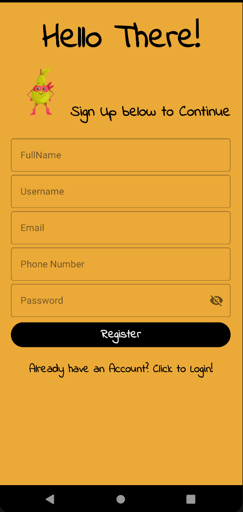 | 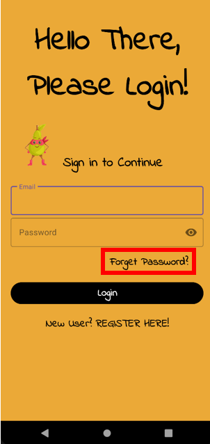 | 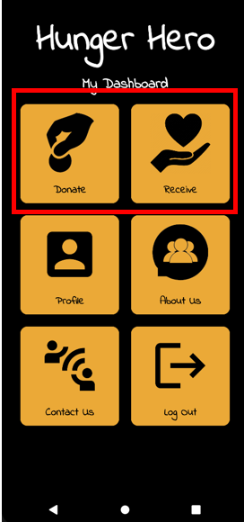 |

| Receiver Verification | Post a Donation | Browse Donations |
|---|---|---|
| 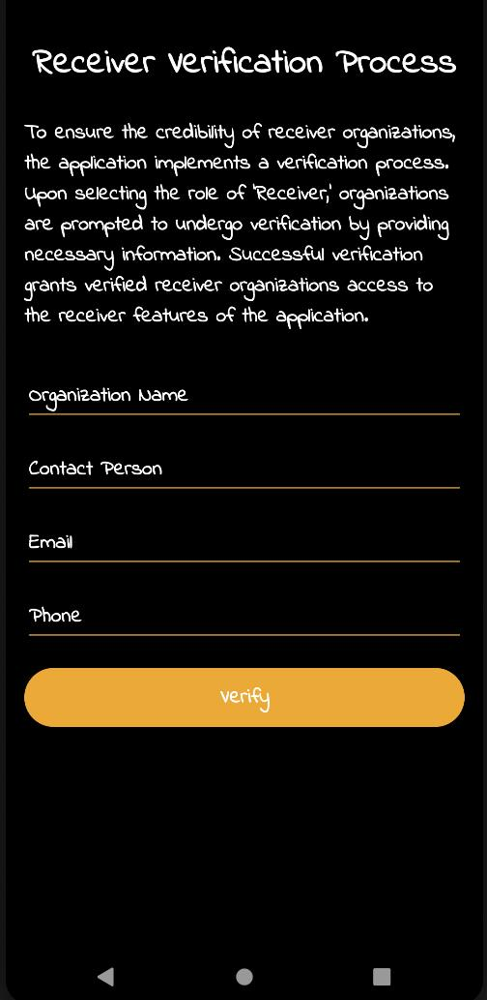 | 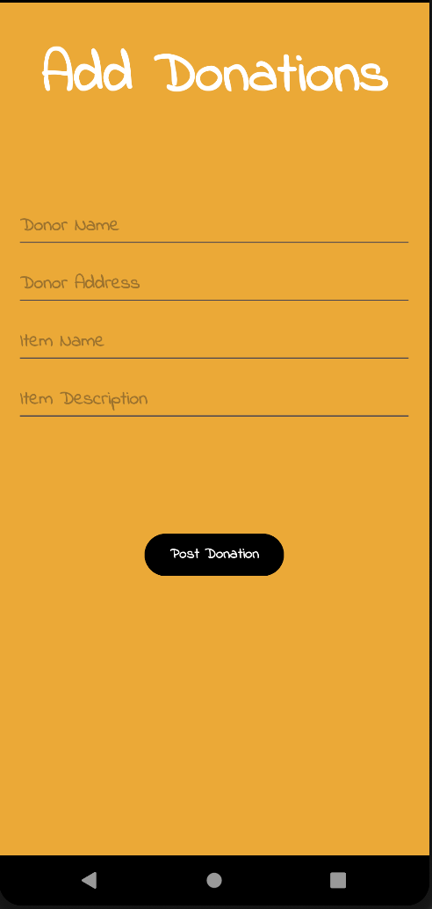 | 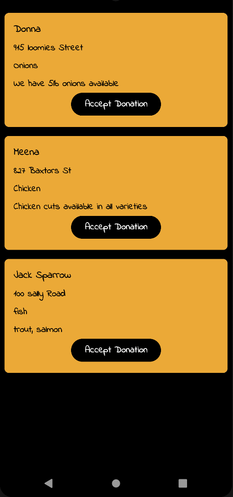 |

| Donor's Posted Donations | Donor's Accepted Donations | Chat |
|---|---|---|
| 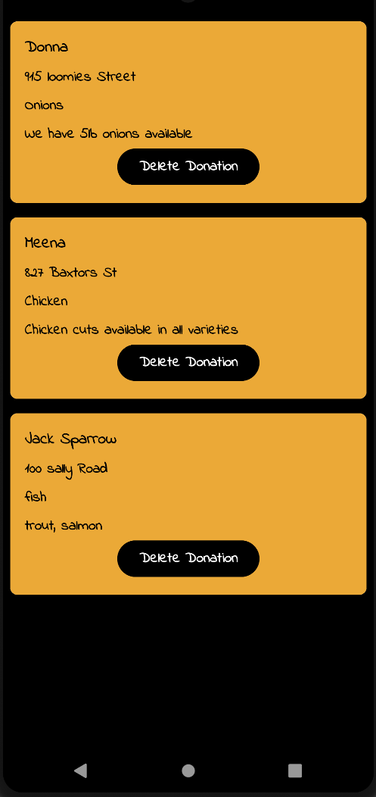 | 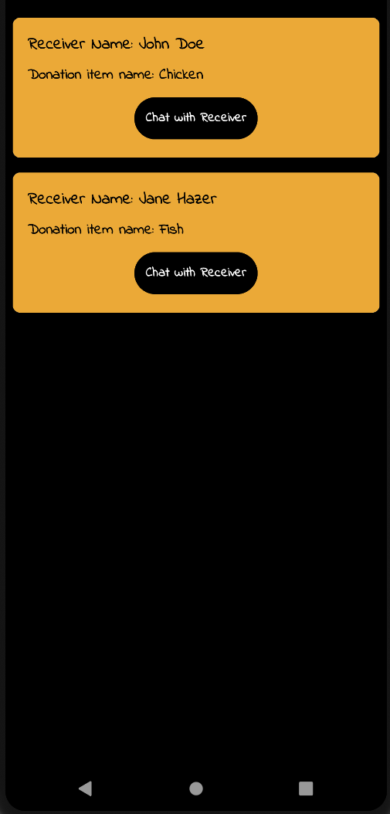 | 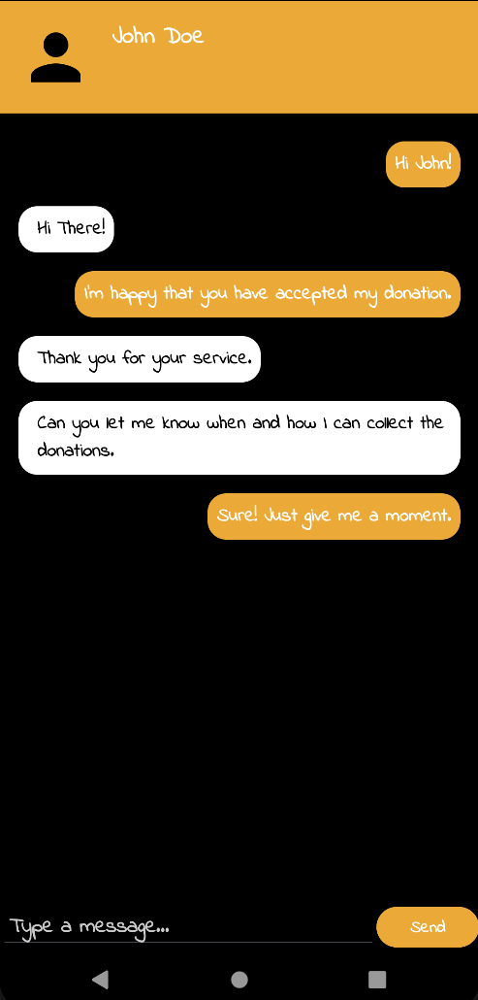 |

| Profile | About Us | Contact Us |
|---|---|---|
| 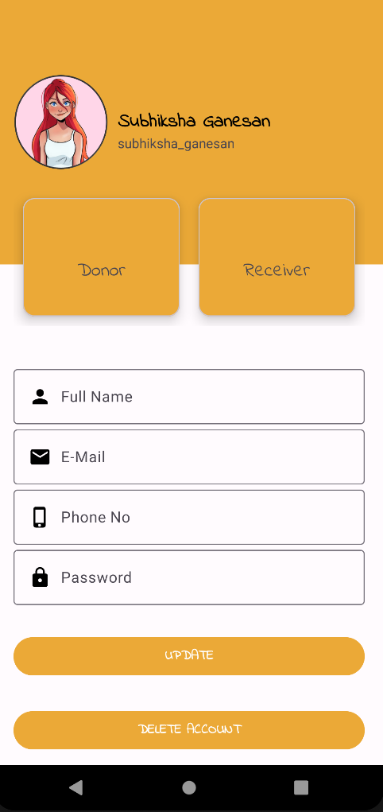 | 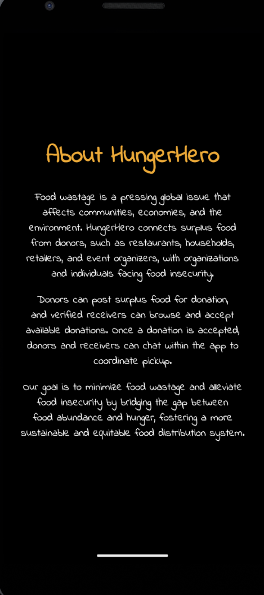 | 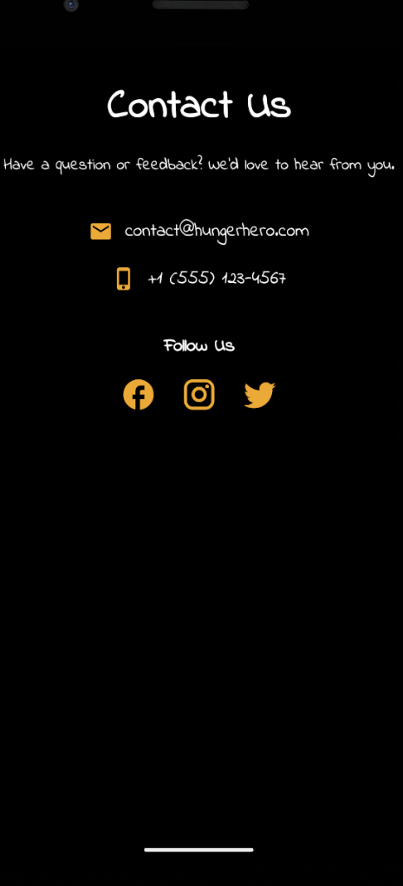 |

## App Flow

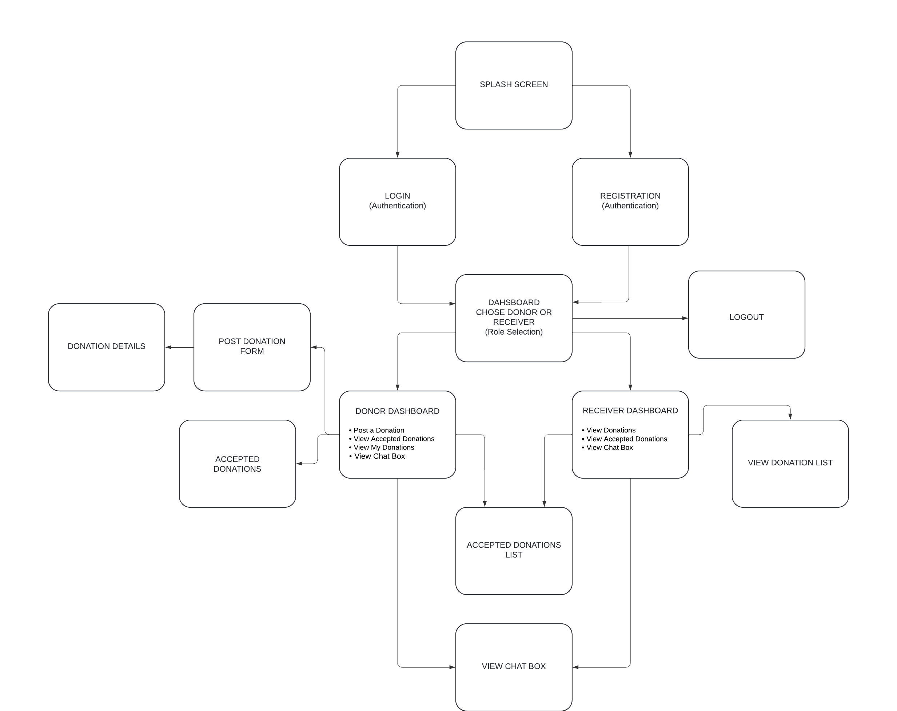

## Tech Stack

- **Android** (Java, Android SDK 34, minSdk 24) — Android Studio, XML layouts (Linear/Constraint/Relative)
- **Firebase Authentication** — email/password sign-in, password reset
- **Firebase Realtime Database** — user profiles, donations, accepted donations, and chat messages
- **Firebase UI Auth**, **CircleImageView**, **Picasso**

## Getting Started

1. Clone the repo and open it in Android Studio.
2. The project is already wired to a Firebase project via `app/google-services.json`. If you're pointing it at your own Firebase project instead, replace that file with your own from the [Firebase Console](https://console.firebase.google.com/).
3. **Realtime Database rules** — the app reads/writes are gated only by Firebase Auth, so the Realtime Database rules need to allow any signed-in user:
   ```json
   {
     "rules": {
       ".read": "auth != null",
       ".write": "auth != null"
     }
   }
   ```
   (Firebase Console → Build → Realtime Database → Rules.) Without this, posting or browsing donations will fail with a "permission denied" error even though the app itself is working correctly.
4. Build and run on an emulator or device (`Run ▸ app`, or `./gradlew installDebug`).

## Project Structure

- `app/src/main/java/edu/uga/cs/hungerhero/` — all activities, adapters, and data model classes
- `app/src/main/res/layout/` — screen layouts
- `app/src/main/res/drawable/` — icons and images
