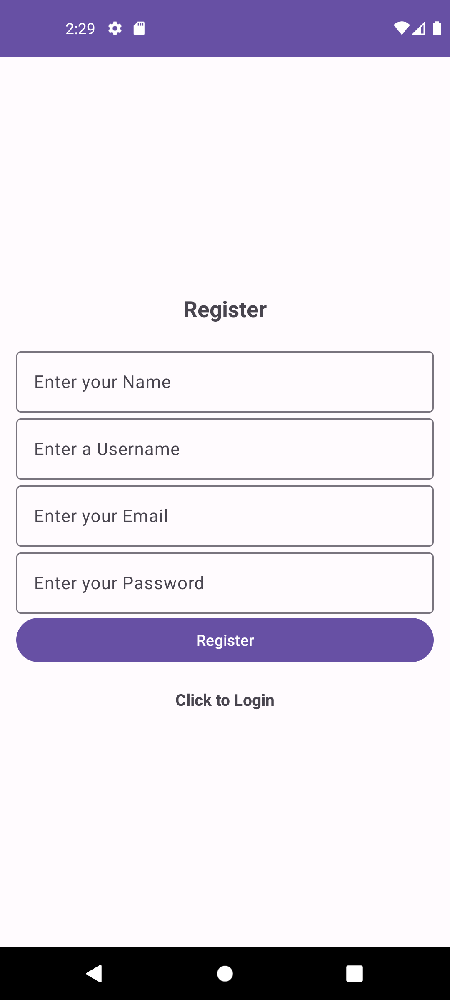
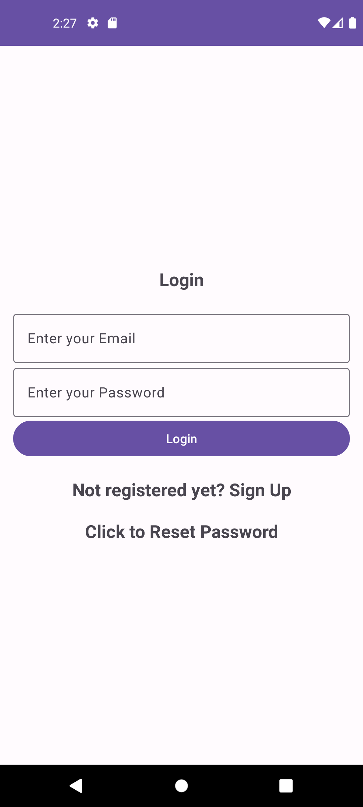
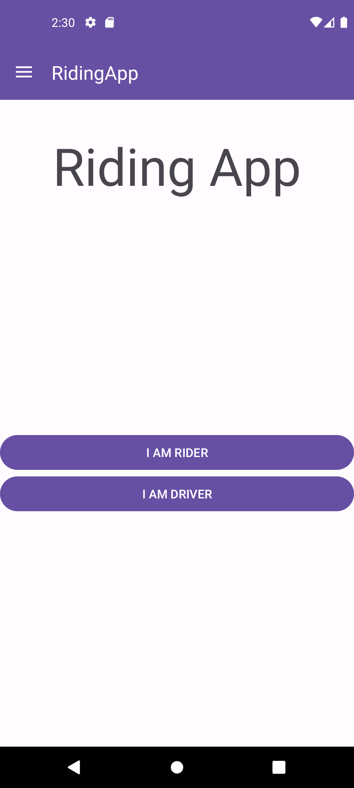
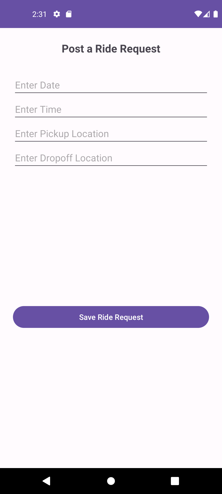
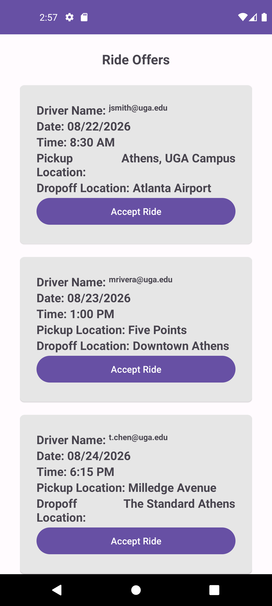
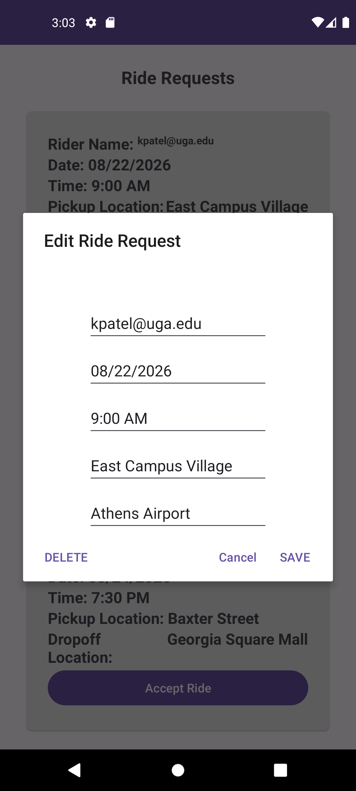
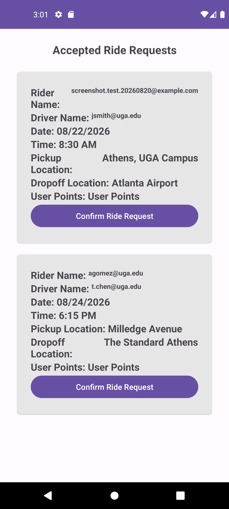
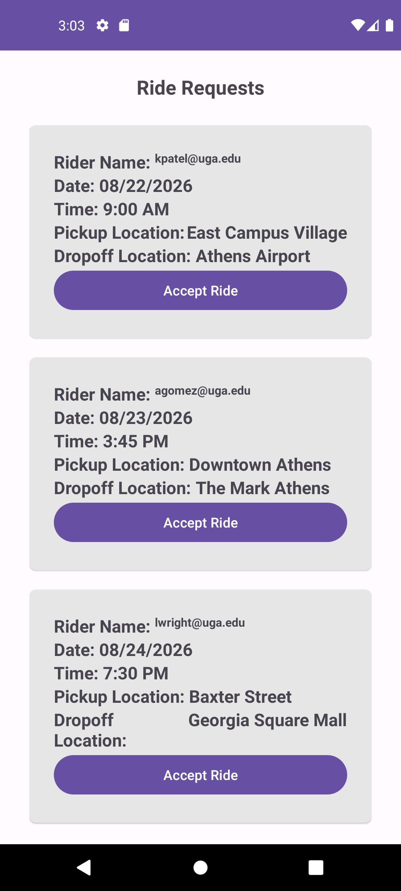

# RidingApp: Campus Ride Sharing App

RidingApp connects UGA students who need a ride (riders) with students willing to give one (drivers), using a simple points system — giving a ride earns you points, and you spend points to get a ride later.

This was built for the CSCI Mobile Software Development final project (App 2: Ride Sharing App), University of Georgia.

## Features

- **Account creation & login** — email/password registration and sign-in via Firebase Authentication, with "Forgot Password" email reset and in-app change password.
- **Driver / Rider roles** — after logging in, a user picks whether they're driving or riding for that session.
- **Post & browse** — drivers post ride offers, riders post ride requests; either side can browse what's currently available and accept one.
- **Manage your own posts** — "My Ride Offers" (driver) and "My Ride Requests" (rider) let you review, update, or delete your own unaccepted posts.
- **Accept & confirm** — accepting a ride offer/request moves it to the accepted-rides list for both parties; confirming a ride transfers ride-points from the rider to the driver.
- **Points balance** — a "My Points" screen shows your current ride-points balance.
- **Remove account** — delete your account and its data at any time.

## Screenshots

### Registration & Login

<table>
<tr>
<td align="center"><br/><sub>Register</sub></td>
<td align="center"><br/><sub>Login</sub></td>
</tr>
</table>

### Navigation

<table>
<tr>
<td align="center"><br/><sub>Driver / Rider role select</sub></td>
<td align="center"><br/><sub>Points balance</sub></td>
</tr>
</table>

### Rider Flow

<table>
<tr>
<td align="center"><br/><sub>Post a ride request</sub></td>
<td align="center"><br/><sub>Browse & accept ride offers</sub></td>
</tr>
<tr>
<td align="center"><br/><sub>Edit an unaccepted request</sub></td>
<td align="center"><br/><sub>Confirm an accepted ride</sub></td>
</tr>
</table>

### Driver Flow

<table>
<tr>
<td align="center"><br/><sub>Post a ride offer</sub></td>
<td align="center"><br/><sub>Browse & accept ride requests</sub></td>
</tr>
</table>

## Tech Stack

- **Android** (Java, Android SDK 34, minSdk 24) — Android Studio, ConstraintLayout
- **Firebase Authentication** — email/password sign-in, password reset
- **Firebase Realtime Database** — user profiles/points, ride offers, ride requests, and accepted rides

## Getting Started

1. Clone the repo and open it in Android Studio.
2. The project is already wired to a Firebase project via `app/google-services.json`. If you're pointing it at your own Firebase project instead, replace that file with your own from the [Firebase Console](https://console.firebase.google.com/).
3. **Realtime Database rules** — the app reads/writes are gated only by Firebase Auth, so the Realtime Database rules need to allow any signed-in user:
   ```json
   {
     "rules": {
       ".read": "auth != null",
       ".write": "auth != null"
     }
   }
   ```
   (Firebase Console → Build → Realtime Database → Rules.) Without this, posting or browsing rides will fail with a "permission denied" error even though the app itself is working correctly.
4. Build and run on an emulator or device (`Run ▸ app`, or `./gradlew installDebug`).

## Project Structure

- `app/src/main/java/edu/uga/cs/ridingapp/` — activities, adapters, and data model classes
- `app/src/main/res/layout/` — screen layouts
